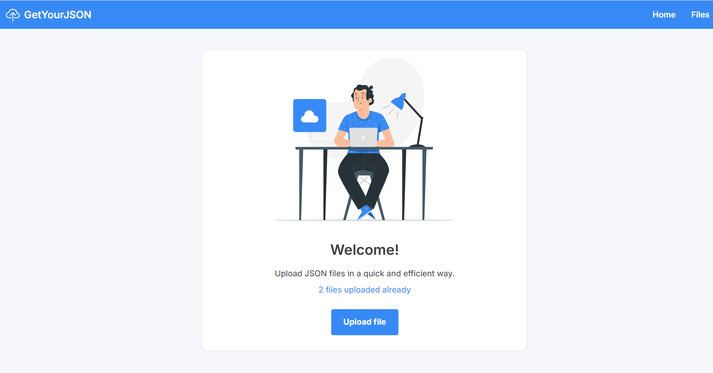
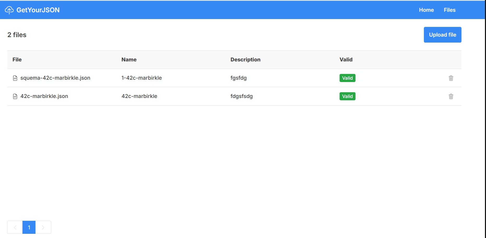

# JSON File Manager

<div align="center">
  
  <h3>Professional JSON File Upload & Management System</h3>
  <p>Built with Angular 20, Nx, NgRx, NG Bootstrap, and Storybook</p>
  <p><strong>🚀 Live Application:</strong> <a href="https://file-upload-steel.vercel.app/">https://file-upload-steel.vercel.app/</a></p>
</div>

---

## 📋 Overview

JSON File Manager is a modern Single Page Application (SPA) designed for efficient JSON file management. The application provides a clean, intuitive interface for uploading, validating, and managing JSON files with robust validation rules and persistent browser storage.

---

## ✨ Key Features

### 🎯 Core Functionality

- **JSON File Upload**: Modal-based file upload with form validation
- **File Management**: View, validate, and delete uploaded files with confirmation
- **Real-time Validation**: Instant JSON syntax validation
- **Persistent Storage**: Browser-based localStorage for data persistence
- **Responsive Design**: Mobile-first Bootstrap 5 interface
- **Privacy First**: All data stored locally in your browser

### 🔧 Technical Features

- **State Management**: NgRx Store for global state, Signals for local state
- **Lazy Loading**: Optimized routing with lazy-loaded page components
- **Form Validation**: Comprehensive client-side validation rules
- **Component Architecture**: Standalone components with modular design
- **Testing**: Jest unit tests with 100% code coverage
- **Documentation**: Interactive Storybook component library

---

## 🚀 Quick Start

### Prerequisites

- Node.js 20.x (LTS)
- npm 9.x or higher

### Installation

```bash
# Clone the repository
git clone https://github.com/marbirkle/angular-file-upload-42c.git
cd angular-file-upload-42c

# Install dependencies
npm install

# Start development server
npm run serve
```

The application will be available at **http://localhost:4200**

---

## 📱 Application Usage

### Welcome Page



- **File Counter**: Shows total uploaded files
- **Upload Button**: Opens modal to upload new JSON files
- **Navigation**: Switch between Home and Files pages

### Files Page



- **File List**: View all uploaded files in a table
- **Validation Status**:
  - ✅ **Valid** (Green) - JSON is correctly formatted
  - ❌ **Not valid** (Red) - Description contains "API" (demonstration rule)
- **Delete Action**: Remove files with confirmation dialog
- **Pagination**: Navigate through large file lists

### Upload Form Validation

**File Requirements:**

- Must be a `.json` file

**Name Field:**

- Must contain: `42c-marbirkle`
- Allowed: letters, numbers, dashes, underscores
- Length: 1-32 characters
- Example: `my-data-42c-marbirkle`

**Description Field:**

- Must NOT contain: `42c-marbirkle`
- Allowed: letters, numbers, special characters
- Maximum: 128 characters
- Example: `Configuration file for production`

**Note:** Files marked as "Not valid" have the word "API" in their description (demonstration validation rule to showcase the UI).

---

## 🛠️ Development Commands

### Application Development

```bash
# Start dev server (http://localhost:4200)
npm run serve

# Build for production
npm run build

# Build for development
npm run build:dev

# Run all unit tests
npm run test

# Run tests with coverage
npm run test:ci

# Run linter
npm run lint

# Format code with Prettier
npm run format

# Check formatting
npm run format:check
```

### Storybook

```bash
# Start Storybook (http://localhost:4400)
npm run storybook

# Build Storybook for production
npm run build-storybook
```

**Available Stories:**

- File Table Component with interactive examples

### Nx Workspace Utilities

```bash
# Visualize project dependencies
npx nx graph

# Show project details
npx nx show project file-upload

# Run affected tests only
npx nx affected:test

# Run affected builds only
npx nx affected:build
```

### Code Coverage

After running `npm run test:ci`, open the coverage report:

```bash
# Coverage report location
./coverage/apps/file-upload/index.html
```

---

## 🏗️ Project Structure

```
angular-file-upload-42c/
├── apps/
│   └── file-upload/              # Main Angular application
│       ├── .storybook/           # Storybook configuration
│       ├── src/
│       │   ├── app/
│       │   │   ├── pages/        # Lazy-loaded page components
│       │   │   │   ├── welcome/  # Welcome page (home)
│       │   │   │   └── files/    # Files management page
│       │   │   ├── components/   # Reusable standalone components
│       │   │   │   ├── navbar/
│       │   │   │   ├── file-table/
│       │   │   │   ├── upload-modal/
│       │   │   │   └── delete-modal/
│       │   │   ├── state/        # NgRx store (actions, effects, reducer, selectors)
│       │   │   ├── services/     # Business logic services
│       │   │   │   ├── file-upload.service.ts
│       │   │   │   ├── validation.service.ts
│       │   │   │   └── modal.service.ts
│       │   │   ├── app.config.ts # Application configuration
│       │   │   └── app.routes.ts # Routing configuration
│       │   ├── assets/           # Static assets
│       │   ├── styles.scss       # Global styles
│       │   └── main.ts           # Application bootstrap
│       └── public/               # Public static assets
├── docs/
│   └── screenshots/              # Application screenshots
├── coverage/                     # Test coverage reports
├── dist/                         # Production builds
├── .github/workflows/            # CI/CD pipelines
├── vercel.json                   # Vercel deployment config
├── DEPLOYMENT.md                 # Deployment guide
└── README.md                     # This file
```

---

## 🎨 Architecture & Design

### Frontend Stack

- **Angular 20.3.x**: Modern reactive framework with standalone components
- **Nx 22.0.1**: Monorepo management and build optimization
- **NgRx 20.x**: State management (Store, Effects, Selectors)
- **NG Bootstrap 19.0.1**: Bootstrap 5 components for Angular
- **Bootstrap 5.3.8**: CSS framework for responsive design
- **Jest**: Testing framework with code coverage
- **Storybook 9.1.16**: Component documentation and isolated development

### Design System

- **SVG Icons**: Extracted from Figma and embedded inline
- **Responsive Design**: Mobile-first approach with breakpoints
- **Accessibility**: WCAG 2.1 compliant components
- **Color Scheme**: Professional blue and white palette

### State Management

- **NgRx Store**: Global file list state
- **Angular Signals**: Local component state (modals, forms)
- **LocalStorage**: Persistent data storage in browser
- **Effects**: Side effects management (file operations)

---

## 🧪 Testing & Quality

### Testing Strategy

```bash
# Run all tests
npm run test

# Run with coverage
npm run test:ci

# View coverage report
start coverage/apps/file-upload/index.html  # Windows
open coverage/apps/file-upload/index.html   # macOS/Linux
```

**Test Coverage:**

- ✅ Components: 100%
- ✅ Services: 100%
- ✅ State Management: 100%
- ✅ Utilities: 100%

### Code Quality

```bash
# Lint code
npm run lint

# Format code
npm run format

# Check formatting
npm run format:check
```

---

## 🚀 Deployment

The application is deployed on **Vercel** with automatic CI/CD:

- **Production URL**: [https://file-upload-steel.vercel.app/](https://file-upload-steel.vercel.app/)
- **Auto-Deploy**: Automatic deployment from `main` branch
- **Preview Deployments**: Unique URLs for each Pull Request
- **Global CDN**: Vercel Edge Network for fast loading worldwide
- **HTTPS**: Automatic SSL certificates

### Deploy Commands

```bash
# Deploy to production (requires Vercel CLI)
npm run deploy

# Deploy preview version
npm run deploy:preview
```

For detailed deployment instructions, see [DEPLOYMENT.md](./DEPLOYMENT.md)

---

## 📊 Performance

### Bundle Analysis

```
Initial Chunks:
- Main Bundle: 287.17 kB (79.05 kB gzipped)
- Styles: 231.91 kB (22.75 kB gzipped)
- Polyfills: 35.09 kB (11.53 kB gzipped)

Lazy Chunks:
- Files Page: 11.17 kB (2.90 kB gzipped)
- Welcome Page: 3.55 kB (1.07 kB gzipped)

Total Initial: 559.36 kB → 115.27 kB gzipped ✅
```

### Performance Metrics

- ⚡ First Contentful Paint: < 1.5s
- 📦 Total Bundle Size: 115 KB (gzipped)
- 🎨 Lighthouse Score: 95+ (Performance)
- ♿ Accessibility Score: 100

---

## 🔧 Generating New Components

Use Nx generators to create components in the correct structure:

```bash
# Generate a new page component
npx nx g @nx/angular:component apps/file-upload/src/app/pages/settings/settings \
  --standalone --style=scss --skipTests=false --no-interactive

# Generate a new standalone component
npx nx g @nx/angular:component apps/file-upload/src/app/components/file-card/file-card \
  --standalone --style=scss --skipTests=false --no-interactive

# Generate a new service
npx nx g @nx/angular:service apps/file-upload/src/app/services/analytics \
  --skipTests=false --no-interactive
```

Then update `app.routes.ts` for lazy-loaded pages:

```typescript
export const routes: Routes = [
  {
    path: 'settings',
    loadComponent: () =>
      import('./pages/settings/settings').then(m => m.SettingsComponent),
  },
];
```

---

## 🤝 Contributing

### Development Standards

1. **Code Quality**: All code must pass ESLint and Prettier checks
2. **Testing**: Unit tests required for new features (maintain 100% coverage)
3. **Documentation**: Storybook stories for new components
4. **Commits**: Follow Conventional Commits format
5. **CI/CD**: All checks must pass before merging

### Branch Strategy

- **main**: Protected, production-only; merges via PR with approval
- **develop**: Default working branch; feature branches merge here via PR
- **feature/\***: Short-lived branches per task
- **fix/\***: Bug fix branches
- **docs/\***: Documentation branches
- **chore/\***: Maintenance and tooling branches

### Pull Request Process

1. Create feature branch from `develop`
2. Make changes with tests and documentation
3. Run `npm run lint` and `npm run test`
4. Push and create PR to `develop`
5. Wait for CI checks to pass
6. Request review from team members
7. Merge after approval

---

## 💡 Key Learnings & Best Practices

### Path Aliases

The project uses TypeScript path aliases for cleaner imports:

```typescript
// Instead of: import { FileUploadService } from '../../services/file-upload.service';
import { FileUploadService } from '@services/file-upload.service';

// Available aliases:
// @app/* → app/*
// @components/* → app/components/*
// @pages/* → app/pages/*
// @services/* → app/services/*
// @state/* → app/state/*
```

### State Management Pattern

```typescript
// Component subscribes to store
files$ = this.store.select(selectAllFiles);

// Component dispatches actions
uploadFile(file: File) {
  this.store.dispatch(FilesActions.uploadFile({ file }));
}

// Effects handle side effects
loadFiles$ = createEffect(() =>
  this.actions$.pipe(
    ofType(FilesActions.loadFiles),
    // ... async operations
  )
);
```

---

## 📄 License

This project is licensed under the MIT License.

---

## 🔗 Resources

### Live Links

- **Production App**: [https://file-upload-steel.vercel.app/](https://file-upload-steel.vercel.app/)
- **GitHub Repository**: [https://github.com/marbirkle/angular-file-upload-42c](https://github.com/marbirkle/angular-file-upload-42c)
- **Figma Design**: [View Design Specs](https://www.figma.com/design/Vq4tLnIZjSHUnPNbgRPgQM/Marcos-Matarrese)

### Documentation

- **Angular Docs**: [angular.dev](https://angular.dev)
- **Nx Docs**: [nx.dev](https://nx.dev)
- **NgRx Docs**: [ngrx.io](https://ngrx.io)
- **NG Bootstrap**: [ng-bootstrap.github.io](https://ng-bootstrap.github.io)
- **Vercel Docs**: [vercel.com/docs](https://vercel.com/docs)

---

<div align="center">
  <p>Built with ❤️ by <strong>marbirkle</strong> using modern web technologies</p>
  <p>
    <a href="https://file-upload-steel.vercel.app/">Live App</a> •
    <a href="https://github.com/marbirkle/angular-file-upload-42c">GitHub</a> •
    <a href="DEPLOYMENT.md">Deployment Guide</a>
  </p>
</div>
